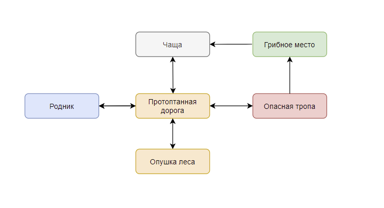

# Console-game
Консольная бродилка, главная цель которой собрать все упавшие вещи и заработать как можно больше золота

* У героя есть несколько основных атрибутов: ``здоровье`` ``сытость`` ``золото`` ``размер инвентаря``
* Игра заканчивается, когда главный герой соберет все предметы с карты или его здоровье опустится до ``0``
* При каждом перемещении по локации уменьшается сытость героя. 
* Чем меньше сытость, тем сильнее начинает падать здоровье при каждом перемещении
* Размер инвентаря - 10 условных единиц. Каждая вещь занимает разное количество единиц в инвентаре
* Съеденный гриб может одновременно поднимать сытость и вредить здоровью
* Чтобы освободить инвентарь, можно продать предметы торговцу или использовать их
* Некоторые предметы предназначены только для продажи
* Перемещение героя осуществляется согласно диаграмме

  

